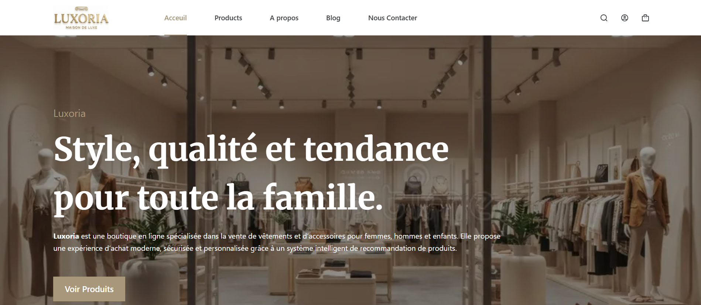
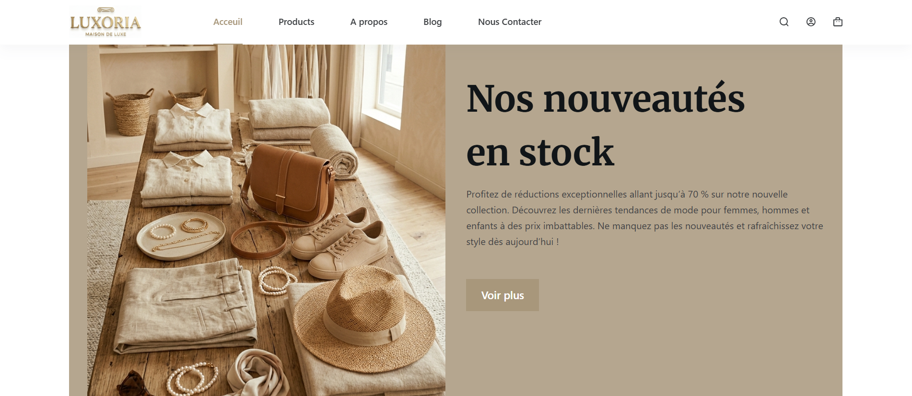
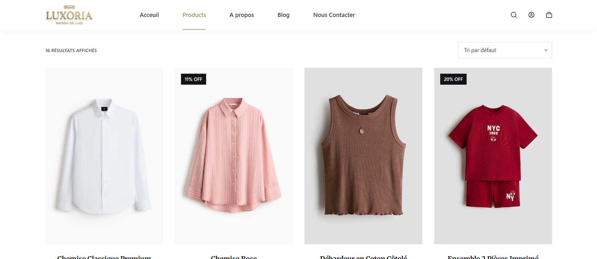
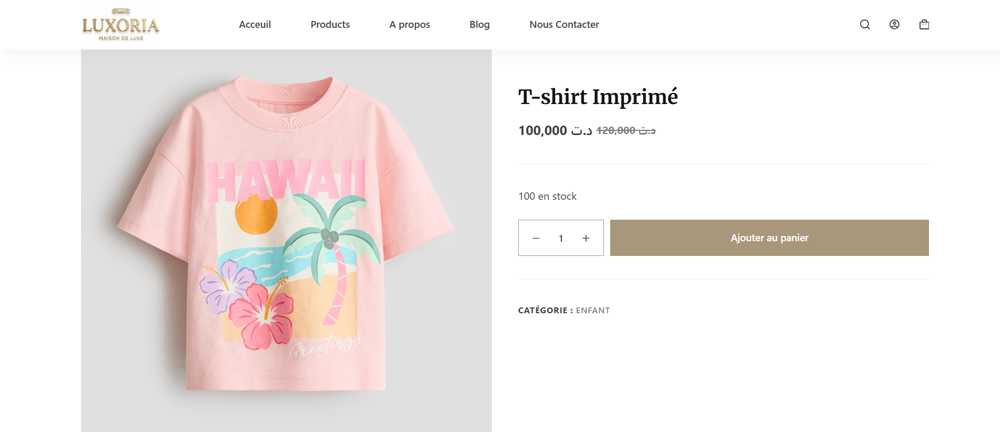
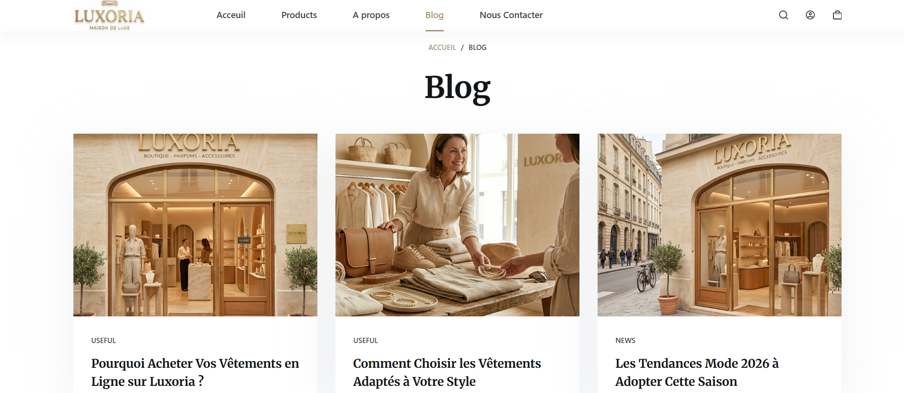
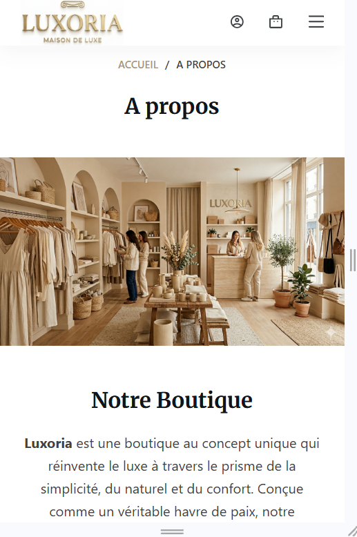
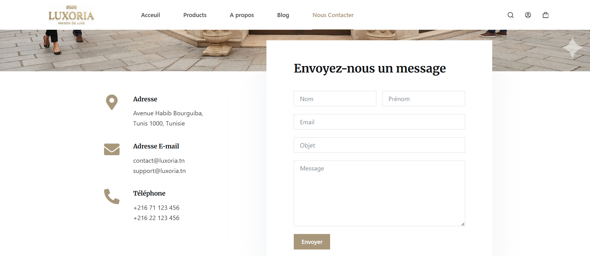
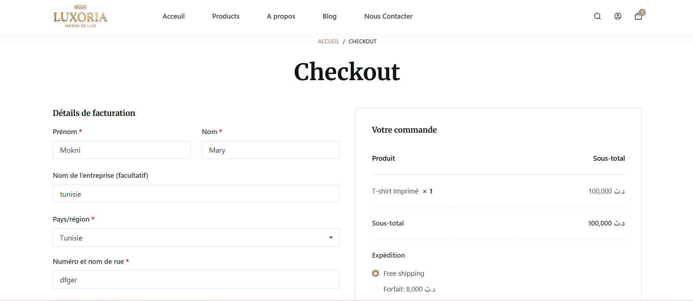

# Luxoria — Boutique en Ligne

> Boutique de mode premium pour femmes, hommes et enfants — expérience luxueuse, design minimaliste.

---

## Aperçu

### Page d'Accueil

  
  &nbsp;
  

### Produits & Détail Produit

  
  &nbsp;
  

### Blog & À Propos

  
  &nbsp;
  

### Contact & Checkout

  
  &nbsp;
  

---

## Description

**Luxoria** est une boutique en ligne moderne spécialisée dans la vente de **vêtements et accessoires** pour femmes, hommes et enfants. Le site offre une expérience utilisateur fluide avec une interface élégante et un design minimaliste inspiré d'un thème **beige luxueux**.

---

## Fonctionnalités

-  **Page d'accueil** — Hero section, collections mises en avant, bannières promotionnelles
-  **Catalogue produits** — Filtrage par catégorie, tri, grille responsive
-  **Détail produit** — Galerie d'images, sélection de taille/couleur, ajout au panier
-  **Panier & Checkout** — Processus d'achat simplifié et sécurisé (WooCommerce)
-  **Blog** — Articles mode, conseils style, actualités de la boutique
-  **À Propos** — Histoire de la marque, valeurs, équipe
-  **Contact** — Formulaire de contact, informations boutique
-  **Design responsive** — Optimisé mobile, tablette et desktop

---

##  Stack Technique

| Technologie | Usage |
|---|---|
| **WordPress** | CMS principal |
| **WooCommerce** | Gestion boutique & paiements |
| **Elementor** | Constructeur de pages |
| **CSS personnalisé** | Thème beige / palette Luxoria |
| **PHP** | Développement thème / plugins |

---

##  Auteur

Développé avec ❤️ par **MOKNI Mariem**

[![GitHub]](https://github.com/MariemMokni)
[![LinkedIn]](https://www.linkedin.com/in/mariem-mokni-658aa52a4/)

---

  <em>Luxoria — L'élégance accessible à portée de clic.</em>

